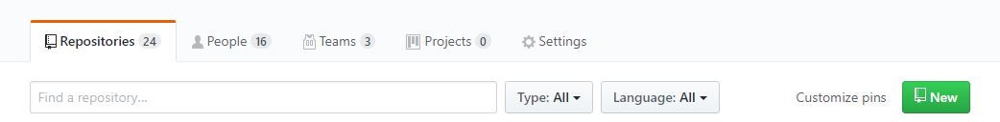
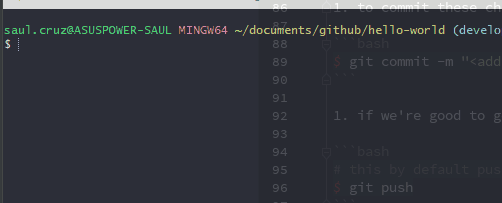
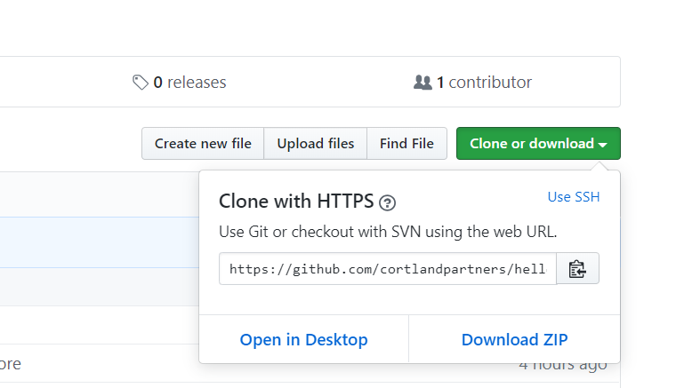
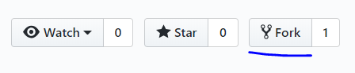

# Getting started with Git and GitHub

### What is Git?
   - Version Control System for tracking changes in source code files
   - Time Machine
   - Distributed version control (Developers in different networks)
   
### What is GitHub?
   - Social code-hosting platform for version control and collaboration , you can even host websites for free
   
In other words, Git is the control system and GitHub is a hosting service for Git with enhanced features

### Concepts of Git

- Keeps track of code history
- Takes "snapshots" of your files
- We decide when to take a snapshot by making a "commit"
- We can always go back in time and see a snapshot of our code
- We can put our code in a staging area
- Use our terminal or Git Bash's terminal

Git is a stream of snapshots (commits)

### GitHub Essentials - Repositories and Branches

**Repository** - organizes a single project, they can contain folders and files, images, videos, spreadsheets and data sets

**Branching** - is the way to work on different versions of a repository at one time


### Step-by-step guide

1. Sign up for an account in GitHub or receive an organization invitation

1. [Download](https://git-scm.com/downloads) and install Git in your local development environment (laptop/desktop)

1. Create Repository in GitHub. Either under your organizations or your personal account. Click on the "New" button


1. Add a descriptive `lowercase-with-hyphens` name, do not initialize a README this time and click on Create.

1. It is recommended to introduce our user and e-mail to every repository
    ```bash
    $git config --global user.name "<your_user_name_here>"
    $git config --global user.email "<your@email.com>"
    ```
1. Now, it is important to understand the following components:
    - Working directory (files) - write changes in our computer's files and represents a particular commit (snapshot)
    - index (staging area) - getting prepared to be packaged into a commit object
    - head (last commit) - point to your last commit on a checked out branch
    
1. Getting started (Clone or fetch)
    1. **Initialize and fetch** - Repository already exists in GitHub and you have code already in your local. 
    
        Note: Replace <<repository-url>> with your GitHub repo URL. i.e. https://github.com/cortlandpartners/hello-world
      
        ```bash
        $ cd <<project-folder>>
        # creates the "develop" branch
        $ git checkout -b develop
        # initializes .git repo in our local environment
        $ git init
        # creates a remote called "origin" linked to "GitHub repo's URL"
        $ git remote add origin <<repository-url>>
        # downloads commits, files and refs from remote repository into our local
        $ git fetch origin
        # check the status of my local working tree repo
        $ git status
        # add your all your new and modified (".") changes to the staging area
        $ git add .
        # push local changes to the remote specified branch
        $ git push origin develop
        ```
        
     1. **Clone repository** - Repository already exists and your local environment is empty (Via HTTPS)
        ```bash
        $ cd <<project-parent-folder>>
        $ git clone https://github.com/cortlandpartners/<<repository-name>>.git
        ```
1. So far we have used the most common git commands, don't forget to also use `$ git help`. It is seriously very helpful if you're starting out.
 
1. At this point we should have a new hidden directory called `.git` in our local project directory. This is where all the magic gets stored so that it can track everything.
 
1. We can either stage a single file with `$ git add <filename>` or all of the new and modified files `$ git add .`
 
1. to commit these changes

    ```bash
    $ git commit -m "<add a descriptive commit message here>"
    ```

1. if we're good to go, then we can run

    ```bash
    # this by default pushes our work to the "origin" remote work
    $ git push
    ```
1. Let's make a simple change to our sample source code in our local project. Let's open `characters.py` and add a new attribute

    ```python
    class Family:
        def __init__(self, name, sigil):
            self.name = name
            self.sigil = sigil
    
        def get_aggressive(self):
            pass
    
    class Character(Family):
    
        def __init__(self, family_name, sigil, name, gender):
            self.name = name
            self.gender = gender
            super().__init__(name=family_name, sigil=sigil)
    ```
1. At any time we can check whether or not we have changes to push

    `$ git status`
    
    
    
1. If we made changes like this time, we can add our files on at a time

    `$ git add hello-world/characters.py`

1. or  `$ git add .` which adds all files, folders and subfolders recursively

1. Then, commit these changes with a commit message and push them through

    `$ git commit -m "Added gender attribute to Characters"`
 
1. Perfect! We can now initialize a repository, stage files, commit files and changes, and finally push them to our current branch

1. Including a README file is also a best practice. In this particular example we decided to not initialize a README however we can add it manually.

    
    
    [Photo by Raj Eiamworakul on Unsplash](https://unsplash.com/@roadtripwithraj?utm_medium=referral&amp;utm_campaign=photographer-credit&amp;utm_content=creditBadge)

1. Let's assume that this repository already exists and some other team has been working on it. We need to **clone a repository** into our computer.
In GitHub, we can get the URL to clone with HTTPS. Copy the url.
 
    
 
1. In your terminal, get to the parent folder directory of your project. Assuming that you have defined your HOME environment variable (i.e. C:\Users\Saul.Cruz\)

    Then clone the repository

    ```bash
    $ cd documents/github-2
    $ git clone <the-url-that-you-just-copied>
    ```
     
1. What if you want to play with an existing project on your own? we can **fork a repository**. This makes a copy of the repo in our personal repositories without affecting the original.

    
    
   This guide will not focus on forking and contributing guidelines, however we have to remember to keep our fork synced by adding an "upstream" remote
   
1. Let's make another change. Let's create an empty `config.yml` file in the source code project directory.

    ```bash
    $ cd ..
    $ cd github/hello-world/hello-world
    $ echo "" > config.yml
    $ cd ..
    $ git status
    $ git add .
    $ git commit -m "Created config file"
    ```
1. Notice that we're committing the changes to the HEAD, but not to the remote repository yet. We just took a snapshot of our repository and included a message with `-m`
    
    To send this change to our remote repository, we have to push
    
      ```bash
      $ git push origin develop
      ```
 **Learning to collaborate and contribute**
 
1. Now we're ready to test our ideas and features in mind. Some features might be good to go but some might not. However, what if we're working with other people with other ideas, tasks, features. This is where **branching** gets into the game.
    
    
    
    [Photo by Yancy Min on Unsplash](https://unsplash.com/@yancymin?utm_medium=referral&utm_campaign=photographer-credit&utm_content=creditBadge)

    A branch is a separate space where we can try out our ideas/features. This way we won't affect the original branch until we are good to go (decide to **merge** it)
1. Let's create a branch
 
  ```bash
  $ git checkout -b new_feature
  ```
  
  This will create a branch where we can make any changes we need. Every time we commit our changes, they will be in this new branch.
  We used `git checkout` to switch branches by updating the index and the files in the working tree and by pointing HEAD at the branch.
  
  If `-b` is given, <new_feature> is created if it doesn't exist, otherwise, it is reset.
  
  1. Let's switch back to `develop`
  
   ```bash
  $ git checkout develop
  ```
  
  1. We can also see all the branches available (both remote and local)
  
  ```bash
  $ git branch -a
  ```
  
  1. Now, let's switch back to `new_feature` and make a change to `characters.py`
   ```bash
  $ git checkout new_feature
  # make the change, i.e. add a comment to characters.py
  $ git status
  $ git add .
  $ git commit -m "Added new functionality to charcaters"
  ``` 
 1. Let's merge these changes back to `develop`
   ```bash
  $ git checkout develop
  $ git merge new_feature
  
  ``` 
 
  
  